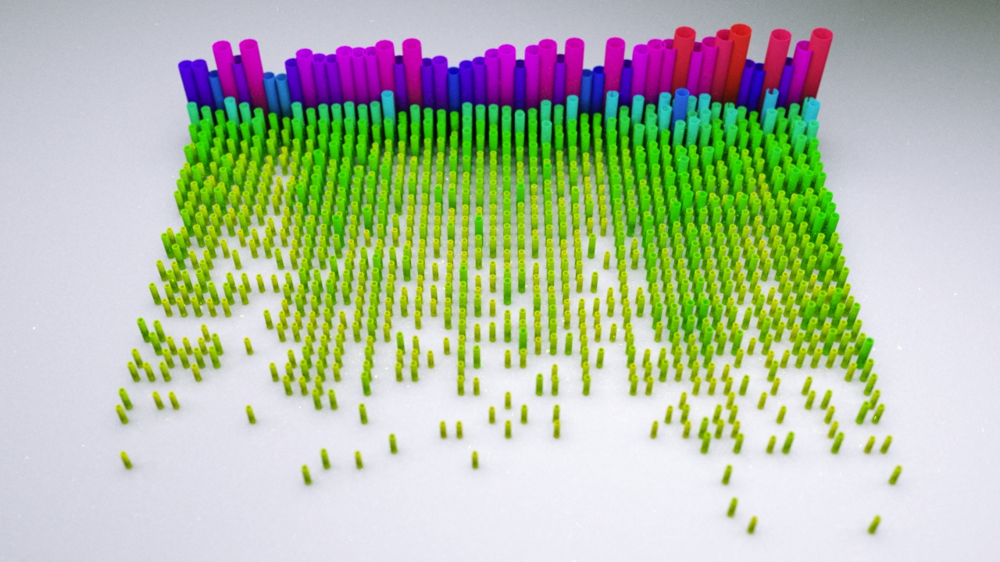
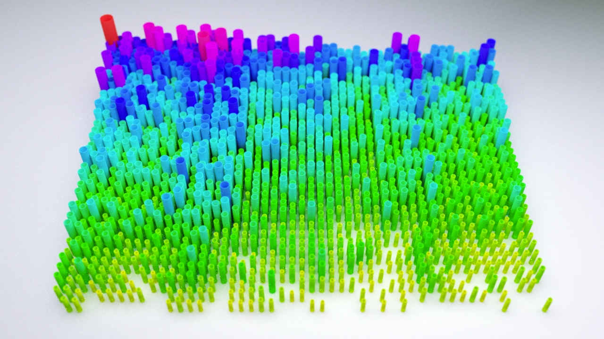
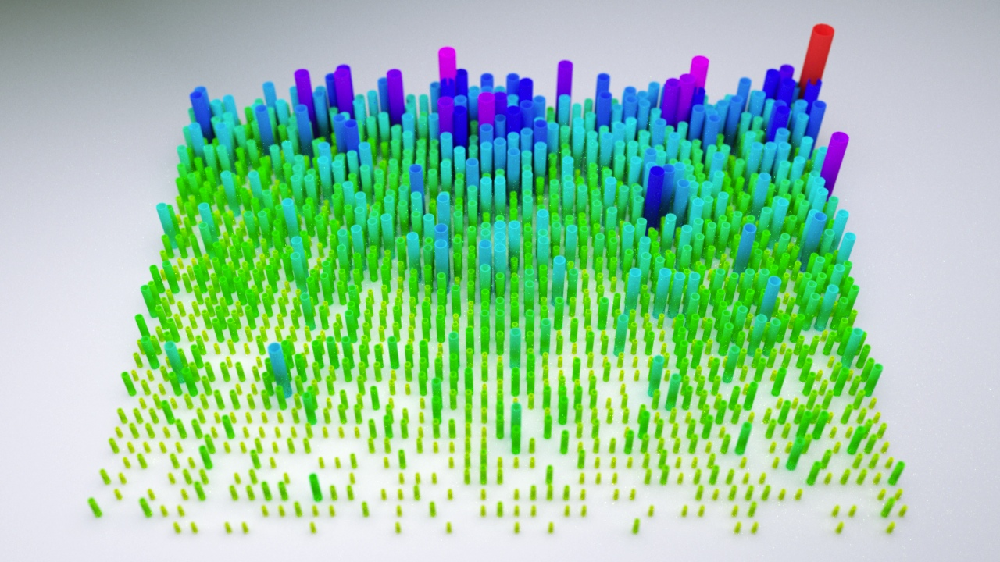

# Clojure workshop @ Resonate 2014

This repo contains various examples & mini-projects created during the
Clojure workshop from 31/03 - 03/04/2014 at Resonate festival in
Belgrade. Each file also contains highly detailed comments and
can/should be run from the REPL (unless stated otherwise).

In the workshop we used the Eclipse-based
[CounterClockwise IDE](http://ccw-ide.org), but this repo contains a
standard [Leiningen](http://leiningen.org) `project.clj` file, so is
not dependent on CCW.

## Exercises

Below is a short summary of the different exercises. Only one of them
can be "run" from a REPL, but the others require manual exectution of
at least a single function call (e.g. see
[ex03](src/resonate2014/ex03/core.clj#L257))...

To launch a REPL from the command line, simply type `lein repl`. This
will download all dependencies too. Be aware that this project is
configured to use Clojure 1.6.0, which requires **Java 7**. If you're
still on Java 6, you'll need to replace/add the following dependencies
in `project.clj` (before launching your REPL):

* replace Clojure 1.6.0 => `[org.clojure/clojure "1.5.1.]`
* add `[org.codehaus.jsr166-mirror/jsr166y "1.7.0"]`

To find out which version of Java is present use `java -version`.

### Text adventure

A little Infocom-style text adventure exercise, in which we introduced
working with nested data structures and learned about ways to deal
with state in an interactive environment. During the development we
discussed Clojure's approach to manipulating state using different
reference types, but settled on using atoms and learned how to use
higher order functions to update their state and illustrate their use
in event handlers for certain player actions. The example also served
as precursor to start thinking about using graphs as data structures
to encode relationships between elements. This mini game setup defines
a number of rooms which are connected in different directions (east,
west, north, south etc.) and thus is forming a graph. Finally, we
introduced the concept of dynamic variables and showed how their use
could help us in defining a tiny DSL to simplify playing the game in
the REPL. The resulting setup should be flexible enough to add more
interactive storytelling & game related puzzle features.

```
Welcome to the Resonate 2014 Clojure adventure.
Can you find the golden treasure?
Type (help) for a list of commands...
------------------------------------------------------------
You are in your hut. You can see an empty bottle of whiskey and an unmade bed.
You can go east.
You carry nothing.

resonate2014.ex01> (go :east)
------------------------------------------------------------
You are in the garden. You can see some beautiful flowers.
You can go east, north, south and west.
You carry nothing.
```

### Linked data graphs

TBD (forthcoming)

### Visualizing CSV statistics in 2D/3D

On our last workshop day we dealt with visualizing a number of open
data sets about London as both SVG and as 3D scene for the open source
[Luxrender](http://luxrender.net). The functions have been re-arranged
and received minor modifications after the workshop to make them more
flexible and allow them to be used with similarly structured CSV
files. We used several sections of this
[London Open Data collection](http://data.london.gov.uk/datastore/package/monthly-ambulance-service-incidents-borough)
about monthly ambulance service incidents, classified by borough and
spanning the time period from Summer 2009 - Summer 2013. The data
files are also located in the `/data` folder of this repo.

Please also see the child namespaces of this example for further
details about SVG & 3D processing. We're making frequent use of higher
order functions to pre-configure various sub-steps of the
visualisation procedure.

The images below are the results of this exercise and also generated
the complete 3D scene file for the [Luxrender](http://luxrender.net)
renderer.

#### London binge drinking by borough



* **Columns:** Months (Jul 2009 - Jun 2013)
* **Rows:** Boroughs, sorted by global average (the top 5 boroughs:
  Westminster, Camden, Lambeth, Southwark, Croydon)
* **Global Value range:** min = 17, max = 360
* **Threshold:** Only entries with > 50 incidents/month are shown

#### London assaults on women by borough



* **Columns:** Months (Jul 2009 - Jun 2013)
* **Rows:** Boroughs, sorted by global average (the top 5 boroughs are:
  Lambeth, Croydon, Southwark, Lewisham, Newham)
* **Global Value range:** min = 0, max = 90
* **Threshold:** Only entries with > 10 incidents/month are shown

#### London knife injuries by borough



* **Columns:** Months (Jul 2009 - Jun 2013)
* **Rows:** Boroughs, sorted by global average (the top 5 boroughs are:
  Southwark, Lambeth, Newham, Lewisham, Haringey)
* **Global value range:** min = 0, max = 25
* **Threshold:** None, all incidents/month are shown

## Links & further reading

* [Clojure tutorial @ CAN](http://www.creativeapplications.net/tutorials/introduction-to-clojure-part-1/)
* [Clojure from the ground up](http://aphyr.com/tags/Clojure-from-the-ground-up)
* [Brave Clojure tutorial](http://www.braveclojure.com/)

More links to resources coming over the next few days...

## License

Copyright © 2014 Karsten Schmidt

Distributed under the Apache Software License v2.0
